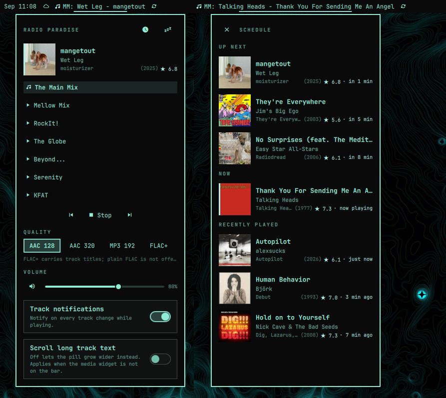

# rpbar

[](https://github.com/tcballard/omarchy-badges)

Omarchy 4 (Quickshell) plugin for [Radio Paradise](https://radioparadise.com):
7 stations streamed via mpv, with MPRIS so the built-in media widget stays
in the loop.

Track metadata (stream + RP API), cached cover art, rich track-change
notifications, 3-line popup, schedule sub-view (up next + recently played,
pre-fetched with art), average RP user ratings.



## Install

From the Omarchy plugin marketplace:

```sh
omarchy plugin add https://github.com/pdfrg/rpbar --enable
```

To update: `omarchy plugin update io.github.pdfrg.rpbar`.

From source (development):

```sh
./scripts/install.sh
```

This rsync-copies the plugin to `~/.config/omarchy/plugins/io.github.pdfrg.rpbar`
(never a symlink — inotify hot-reload does not traverse symlinks) and
restarts the shell. Re-run after every change with a bumped `buildId`.

## Use

- Left-click the pill: play / stop (note glyph = playing, sleep glyph =
  playing
  with a sleep timer running — the hover tooltip shows its countdown).
  Pausing
  via media keys / the media widget shows a dimmed triangle; clicking
  it resumes.
- Dropped streams reconnect on their own (up to 5 tries, then one
  "Gave up reconnecting" toast): the pill dims and the popup shows
  "Buffering…" while stalled. Stopping during a stall stays stopped.
- The pill adapts to the built-in media widget: when `omarchy.media`
  shares the bar, the pill stays compact (station name only — the
  media widget already shows `Artist - Title`). When media is absent,
  the pill shows the track itself (`MM: Artist - Title`). Detection is
  per-bar and switches live when the bar layout changes.

| Key | Pill | Station | Chan |
|---|---|---|---|
| 1 | MM | The Main Mix | 0 |
| 2 | ML | Mellow Mix | 1 |
| 3 | R | RockIt! | 2 |
| 4 | G | The Globe | 3 |
| 5 | B | Beyond... | 5 |
| 6 | S | Serenity | 42 |
| 7 | K | KFAT | 945 |
- Right-click the pill: popup with now-playing (Title / Artist /
   Album (Year)) + cover, 7 stations, a quality row (AAC 128 / AAC 320 /
   MP3 192 / FLAC+; serenity offers 64k AAC and FLAC only), transport with prev/next-station
   dial, volume slider (0–130, per-station memory; right-click slider or
   `m` to mute; mouse wheel on the pill adjusts volume too),
   and a track-notifications toggle (on by default). The sleep button in the
   popup header (highlighted while a timer runs) swaps to a same-size
   sleep view: Off / 15 / 30 / 60 with a live countdown (session-only —
   cancelled if you stop or switch stations). Clicking
  the current station does nothing; Stop is the stop path.
- Clicking the cover opens the station's Radio Paradise page (now playing,
  bio, lyrics, comments) in the default browser — pause rpbar first
  if your browser autoplays the web player. Right-clicking the cover opens
  large album art in the default image viewer (imv). Press q to close.
- The clock button in the popup header swaps to a same-size schedule
  view: UP NEXT (up to 3 upcoming songs from the station's announced
  block, with "in X min" cues), NOW (the playing track, accent-barred),
  and RECENTLY PLAYED (history filling the 7 fixed rows, with "N min
  ago" cues). Same art + 3-line rows throughout; ✕ returns to the main
  view. Upcoming art is pre-fetched, so track-change notifications land
  instantly with art instead of waiting for a download. Near the end of
  a block the view may briefly show no upcoming songs while the next
  block is awaited (usually under 2 minutes).
- The stream answers to media keys via MPRIS (mpv-mpris autoloads).
  Prev/next keys have no stream meaning (single-item playlist) and do
  nothing — use the popup dial to change stations.
  The media widget shows the ICY "Artist - Title" one-liner: mpv
  exposes metadata read-only, so the 3-line split is impossible
  from our side (verified against mpv-mpris source).

Track info is stream-first (ICY title over mpv IPC) with album / year /
cover filled in from the RP API seconds later — or instantly when the
track was pre-announced in the station block. Every row also shows the
average RP user rating (`★ 6.5` on the 0–10 scale, hidden when the API
carries none), and track-change notifications carry it folded into the
album line (omarchy renders at most 3 notification body lines). Covers cache to
`~/.cache/rpbar/art/` (kept to the newest 50) so popup reopens and
revisits are instant. Notifications fire once per track when
enrichment lands, with the cached art attached.

### Keyboard

Bind the popup (add to `~/.config/hypr/bindings.lua`):

```lua
o.bind("SUPER + SHIFT + ALT + R", "rpbar", "omarchy-shell shell toggle io.github.pdfrg.rpbar")
```

(`SUPER+CTRL+R/N/P` are taken by reminder/nightlight/power;
`SUPER+SHIFT+R` is a common TUI slot. `SUPER+SHIFT+ALT+N/P` pair well
as next/prev station via `omarchy-shell io.github.pdfrg.rpbar stepStation 1` /
`stepStation -1`.) Inside the popup:
`1-7` switch station, `Up/Down` dial, `Space/Enter` play/stop, `m` mute,
`Tab` hops to the neighboring panel, `Esc` closes.

## Configure

`~/.config/rpbar/config.json` (created on first save):

```json
{
  "station": 0,
  "quality": "aac-128",
  "volume": 70,
  "notifyOnTrackChange": true,
  "pillWidthMode": "scroll",
  "pillMaxWidth": 180
}
```

`pillWidthMode` controls the track-showing pill (media absent):
`"scroll"` keeps a fixed `pillMaxWidth` (pixels, default 180, same as
the media widget) and marquees long text; `"grow"` lets the pill widen
with the text. Toggle it from the popup ("Scroll long track text").

After hand-editing, run `omarchy restart shell` (reopening the popup is
not enough — `FileView.watchChanges` quirk).

To force notifications off regardless of the popup toggle, add
`"trackNotifications": false` to this widget's entry in
`~/.config/omarchy/shell.json`. Same entry also accepts
`"pillWidthMode": "grow"` and `"pillMaxWidth": <pixels>` as hard
overrides for the track-pill width behavior.

## Dependencies

rpbar shells out to tools that are present on a standard Omarchy install.
It installs nothing itself — no package installs, no downloads outside
Radio Paradise, no services or timers:

| Tool | Purpose |
|---|---|
| `/usr/bin/mpv` (+ system mpv-mpris) | audio engine; MPRIS for the media widget and media keys |
| `/usr/bin/curl` | Radio Paradise API (`api.radioparadise.com`) and cover art (`img.radioparadise.com`), all bounded (`--max-time`, `--max-filesize`, no redirect-following) |
| `/usr/bin/notify-send` | track-change and status toasts (static strings + sanitized metadata, argv-only) |
| `/usr/share/omarchy/bin/omarchy-launch-browser` | open the station's Radio Paradise page |
| `/usr/bin/xdg-open` | open large (500px) cover art in the image viewer |
| `/usr/bin/{mkdir,cat,ls,tail,xargs,rm,pkill}` | cache/state dir setup, bounded art-cache trim, stale-socket cleanup at startup |

Network use is Radio Paradise only (`stream` / `api` / `img`
`.radioparadise.com`, https): the audio stream itself, a 12 s
`now_playing` enrichment poll while playing, event-driven schedule
fetches (`/play` block + history), and cover-art downloads. No login,
no credentials, no telemetry. Details in [`SECURITY.md`](SECURITY.md).

## Data & state

- `~/.config/rpbar/config.json` — own config (station, quality, volume,
  notification + pill preferences). Hand-edits need `omarchy restart shell`.
- `~/.cache/rpbar/art/` — cover thumbnails (newest 50 kept).
- `~/.cache/rpbar/large/` — one-shot large art for the image viewer.
- `$XDG_RUNTIME_DIR/mpv/rpbar-socket` — mpv JSON IPC socket (runtime only).
- `~/.config/omarchy/shell.json` — optional per-widget overrides
  (`trackNotifications`, `pillWidthMode`, `pillMaxWidth`); your file,
  only read, extended solely with keys you add yourself.
- `~/.config/hypr/bindings.lua` — only the keybinding lines you add yourself.

## Removal

Stop playback first, then:

```sh
omarchy plugin remove io.github.pdfrg.rpbar
rm -rf ~/.config/rpbar ~/.cache/rpbar   # optional: own state
```

then delete the rpbar lines from `~/.config/hypr/bindings.lua` and undo
any `shell.json` widget overrides. No services, timers, or packages to
clean up — nothing outside the paths above is ever touched.

## Develop

```sh
./check
./scripts/install.sh
omarchy-shell io.github.pdfrg.rpbar buildInfo
omarchy-shell io.github.pdfrg.rpbar schedule
```

(`shell call <id> ...` only routes to panel/overlay/menu loaders — this
plugin is service + bar-widget, so it exposes its own `IpcHandler` target
instead. Volumes, mute, sleep, and direct-play live there too:)

```sh
omarchy-shell io.github.pdfrg.rpbar setVolume 80
omarchy-shell io.github.pdfrg.rpbar volumeUp 5
omarchy-shell io.github.pdfrg.rpbar toggleMute
omarchy-shell io.github.pdfrg.rpbar sleep 30
omarchy-shell io.github.pdfrg.rpbar playStation '{"station":1,"quality":"flacm"}'
```

Keyboard: `omarchy-shell shell summon|toggle|hide io.github.pdfrg.rpbar`
opens the popup on the focused monitor (see Keyboard under Use for bindings).
Mouse wheel on the pill adjusts volume (±5/notch, per-station memory).
Right-click a cover for the large (500px) art in the image viewer;
left-click still opens the station page.

## License

MIT — see [`LICENSE`](LICENSE).
